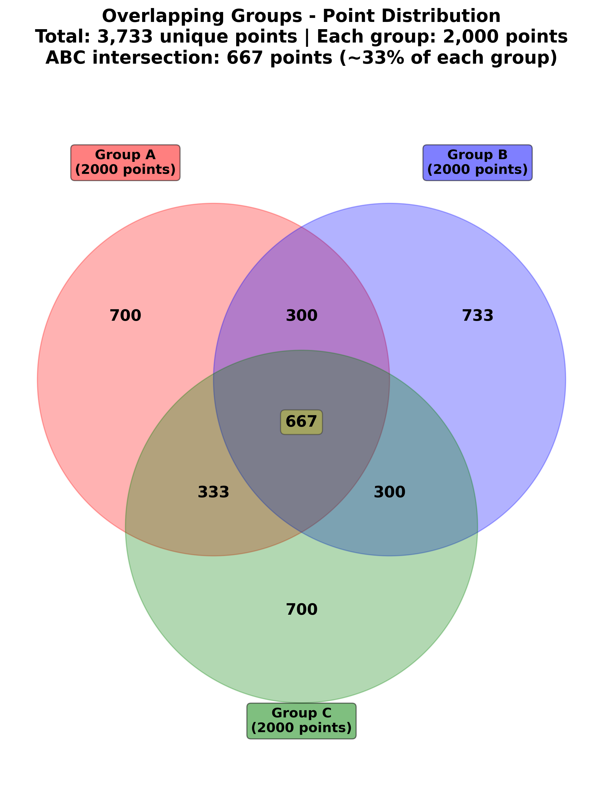
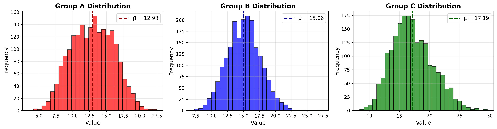

# Overlapping Groups Statistical Analysis

## Assignment Overview

This project implements a computational statistics assignment focused on **Maximum Likelihood Estimation (MLE)** and **Gaussian Mixture Models (GMM)**. The task involves creating three overlapping groups with specific constraints and performing statistical analysis on them.

### Assignment Requirements

1. **Three Overlapping Groups (A, B, C)**
   - Each group must partially overlap with the others (Venn diagram structure)
   - No group should be fully isolated

2. **Point Distribution Constraints**
   - Total of 6,000 points distributed across groups
   - Each group contains exactly 2,000 points
   - **Key constraint**: Approximately 1/3 of each group's points (≈667 points) must be in the intersection of all three groups (A ∩ B ∩ C)
   - Points in overlapping regions belong to multiple groups

3. **Statistical Analysis**
   - Calculate mean (μ̂) and variance (σ̂²) for each group using MLE estimators
   - Each point has an underlying value sampled from Gaussian distributions
   - Connect findings to MLE and GMM principles

4. **Documentation**
   - Clear breakdown of points across all regions
   - Visual Venn diagram representation
   - Statistical calculations with explanations
   - Connection to theoretical concepts (MLE/GMM)

---

## Solution Overview

### Distribution Summary

| Region | Points | Description |
|--------|--------|-------------|
| A only | 700 | Exclusive to Group A |
| B only | 733 | Exclusive to Group B |
| C only | 700 | Exclusive to Group C |
| A ∩ B | 300 | Shared by A and B only |
| A ∩ C | 333 | Shared by A and C only |
| B ∩ C | 300 | Shared by B and C only |
| **A ∩ B ∩ C** | **667** | **Shared by all three (33.35%)** |
| **Total** | **3,733** | **Unique points** |

### Group Totals
- **Group A**: 700 + 300 + 333 + 667 = 2,000 points ✓
- **Group B**: 733 + 300 + 300 + 667 = 2,000 points ✓
- **Group C**: 700 + 333 + 300 + 667 = 2,000 points ✓

---

## Project Structure

```
Home_assinment/
├── main.py                    # Main orchestration script
├── data_generation.py         # Point distribution and data sampling
├── statistics_1.py            # Statistical calculations (MLE estimators)
├── visualization.py           # Venn diagram and histogram plotting
├── analysis.ipynb             # Jupyter notebook with interactive solution
├── report.md                  # Detailed written report
├── README.md                  # This file
└── outputs/                   # Generated files
    ├── group_statistics.csv
    ├── group_data.npz
    ├── venn_diagram.png
    └── distributions.png
```

---

## Installation

### Prerequisites

```bash
pip install numpy pandas matplotlib
```

For Jupyter notebook support:
```bash
pip install jupyter notebook
```

---

## Usage

### Option 1: Run Python Script

Execute the complete analysis pipeline:

```bash
python main.py
```

This will:
1. Generate data with overlapping groups
2. Calculate statistics (mean, variance) using MLE
3. Create visualizations (Venn diagram, histograms)
4. Save results to CSV and NPZ files

### Option 2: Jupyter Notebook (Interactive)

For an interactive, step-by-step analysis:

```bash
jupyter notebook analysis.ipynb
```

The notebook includes:
- Code cells with detailed explanations
- Interactive visualizations
- Statistical analysis with interpretations
- Connection to MLE and GMM theory

---

## Output Files

After running the analysis:

1. **group_statistics.csv** - Summary statistics for all groups
2. **group_data.npz** - Raw data arrays for reproducibility
3. **venn_diagram.png** - Visual representation of overlapping groups
4. **distributions.png** - Histogram distributions with means

---

## Visualizations

### Venn Diagram



The Venn diagram illustrates the overlapping structure of the three groups. Each circle represents one group (A, B, or C), with numbers indicating how many points belong to each region. The central intersection (667 points, highlighted) represents the key constraint: approximately 1/3 of each group's points belong to all three groups simultaneously. This visualization clearly shows:
- How points are distributed across exclusive and shared regions
- The symmetry in the design (Groups A and C have equal exclusive points)
- The significant overlap that creates mixture complexity

### Distribution Histograms



The three histograms show the empirical distributions of values for each group, with the MLE-estimated mean (μ̂) marked by a dashed vertical line. Key observations:
- **Group A** (red): Lower mean, influenced by its exclusive region centered at μ=10
- **Group B** (blue): Middle mean, most balanced due to larger exclusive region at μ=15
- **Group C** (green): Higher mean and wider spread, influenced by its exclusive region at μ=20

The overlapping membership causes each group's distribution to be a mixture of the underlying Gaussian components, demonstrating the GMM structure. The variance differences reflect how the overlapping regions create heterogeneity within each group.

---

## Key Concepts

### Maximum Likelihood Estimation (MLE)

The analysis uses MLE estimators for Gaussian distributions:

**Mean estimator:**
```
μ̂ = (1/n) Σ x_i
```

**Variance estimator:**
```
σ̂² = (1/(n-1)) Σ (x_i - μ̂)²
```

These estimators are:
- **Unbiased** (using Bessel's correction)
- **Consistent** (converge to true parameters)
- **Efficient** (minimum variance among unbiased estimators)

### Gaussian Mixture Models (GMM)

The overlapping structure represents a 3-component GMM where:
- Each group is a Gaussian component
- Points in overlapping regions have membership in multiple components
- The 33% central intersection demonstrates significant mixture complexity
- With known memberships (hard assignments), parameters are directly identifiable via MLE

---

## Reproducibility

All random number generation uses seed=42 for reproducibility. Running the code multiple times will produce identical results.

---

## Report

See [`report.md`](report.md) for:
- Complete statistical analysis
- Detailed explanation of MLE and GMM connections
- Verification of all constraints
- Visualizations with interpretations

---

## Author

Koby Lev - Ai Dev Experts student

---

## License

Educational use only.
